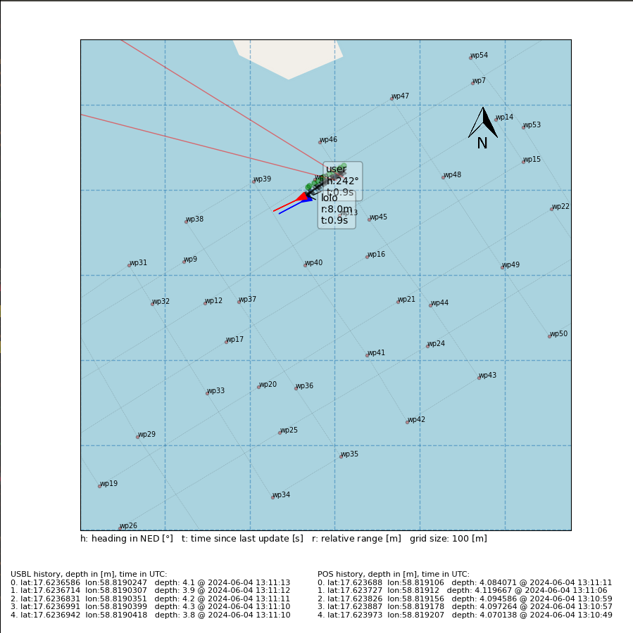

# USBL tools package
This repo is a compilation of useful scripts and tools to interface, communicate,
and visualize data provided by the Evologics SR17 USBL and acoustic communication
modem. Specifically used for research and development using the AUV LoLo from
the Maritime Robotics Laboratory at the KTH Royal Institute of Technology as
part of the Swedish Maritime Robotics Centre (SMaRC) project.

## Dependencies
To interface the sensors (USBL + SBG AHRS), you need to get their ROS-drivers:
 - My fork of the [dmac ros driver](https://github.com/aldoteran/dmac.git),
 - The [sbg_driver](https://github.com/SBG-Systems/sbg_ros_driver.git),
In order to run the WaterTag GUI, you're gonna need some more python-specific
libraries:
 - The [utm](https://pypi.org/project/utm/) library,
 - [TileMapBase](https://github.com/MatthewDaws/TileMapBase) which handles the OpenStreetMap overlays and transformations,
 - [matplotlib](https://matplotlib.org/) to display the GUI and plot the relevant information,
 - and [scipy](https://scipy.org/), that we just use because it's convenient for quaternion rotations.
If I forgot something, python will let you know.

## Nodes

### usbl_correction_relay
This node will take the measured USBLLONG's range and the lat/lon from the SBG AHRS and relay it
to LoLo. Not much to do but `rosrun usbl_tools usbl_correction_relay.py` and Lolo will know what
to do with the message.

### usbl_fix_relay
This node is specifically used for the prox-ops experiments. We relay the corrected USBLLONG position fix
to LoLo in order to track the service boat as a target. Just `rosrun usbl_tool usbl_fix_relay.py` to run.

### bash aliases
TBD.

## WaterTag GUI
This simple GUI was developed in order to qualitatively track the performance of LoLo while she's
underwater. It uses the data provided by the USBL positioning system, messages received from LoLo's
acoustic modem, and GNSS + attitude data provided by an SBG AHRS to:
    - plot the position and heading of the topside unit wrt the world frame,
    - plot the position and estimated heading of LoLo as claculated by the USBL,
    - plot the current mission LoLo has embarked on,
    - and provide additional information regarding any of the above.

The GUI looks something like this:



To run, it is a little bit tricky. If you have internet connection, it shouldn't be a problem,
just choose a `mission_file` (if available otherwise it'll just center the map on the user's GNSS),
a `grid_size` in meters, a `zoom_level` for the map (will impact the tiles resolution), and `degree_padding`
which is basically how much you want your original view to be zoomed out. Then just run
```
roslaunch usbl_tools watertag_vis.py mission_file:=/home/lolo_laptop/your_fav_mission.json grid_size:=100
zoom_level:=15 degree_padding:=0.01
```
This should launch the visualization and start showing the position of the user, and if the USBL is pinging,
of LoLo too. It additionally overlays the mission plan and you can hover over each waypoint with the mouse
to get more information about each of them.

A little extra work is required to run the GUI offline: you have to cache the tiles beforehand to make it
work. Luckily, I've provided a script that extracts and caches the tiles inside a square constrained by
four lat/lon pairs (namely the corners), at the zoom level of the user's choosing. You just have to run,
the `extract_tiles.py` script in the utils directory as follows:
```
python3 extract_tiles.py /path/to/lat_lon_square.json zoom_level
```
where the json file is just a list of dictionaries with the four lat/lon pairs required. An example of
this json file is available in the examples directory.


